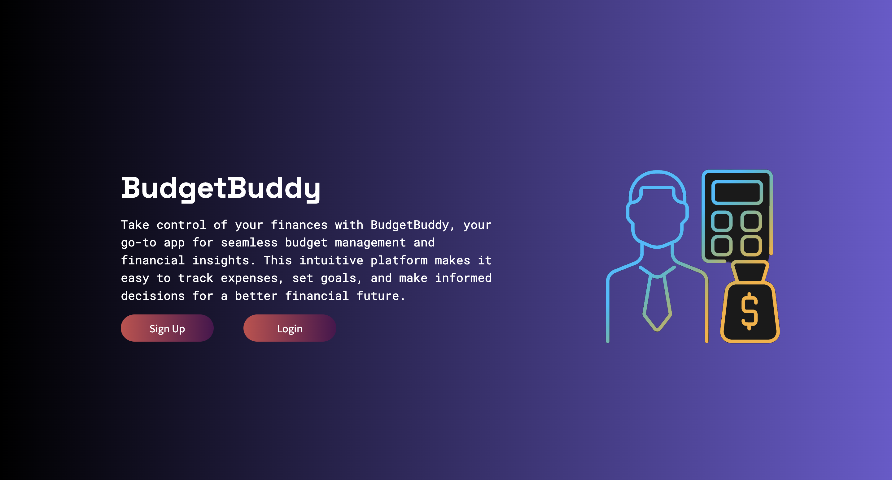
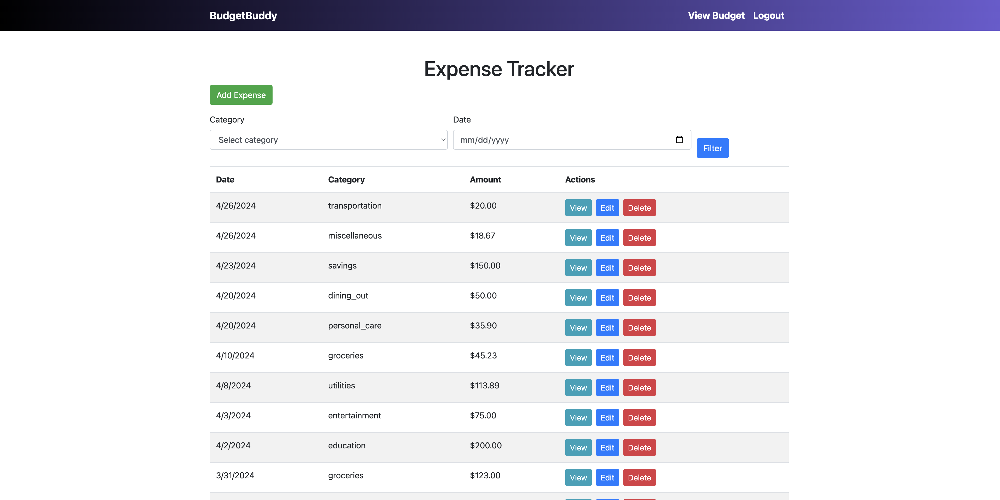
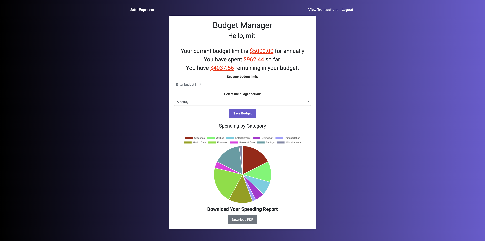

# BudgetBuddy Final Project - ITMD 442

## Mitansh Chaudhari

- **Email**: [mchaudhari1@hawk.iit.edu](mailto:mchaudhari1@hawk.iit.edu)
- **Course**: ITMD 442, Final Project

## Project Description

BudgetBuddy is a web-based personal finance management tool designed to help users effectively track and manage their expenses and budgets. The application features an intuitive dashboard that allows users to view transactions, set budget limits, and analyze their spending habits through interactive charts. By providing real-time insights into financial activities, BudgetBuddy empowers users to make informed decisions and achieve their financial goals. The platform also includes secure user authentication and the ability to download detailed budget reports, enhancing both usability and accessibility.

## Tech Stack

- **Backend**: Node.js, Express.js
- **Frontend**: Bootstrap, HTML, CSS, JavaScript
- **Database**: MongoDB Atlas
- **Tools**: Visual Studio Code, Google Docs
- **Deployment**: Localhost for development, potential for cloud deployment

## Development Environment

The development environment for this project includes:

- **Operating System**: MacBook Air M1
- **Node.js Version**: v20.11.0
- **NPM Version**: 10.5.0
- **Editor**: Visual Studio Code

## Installation and Running Instructions

To set up and run the project, follow these steps:

1. Clone the repository:
   ```bash
   git clone https://github.com/MitChaudhari/BudgetBuddy.git
   ```
2. Navigate to the project directory:
   ```bash
   cd BudgetBuddy
   ```
3. Obtain the `.env` file from the course Blackboard.

4. Install the required dependencies:
   ```bash
   npm install
   ```
5. Start the application in development mode:
   ```bash
   npm run dev
   ```
6. Access the application in your web browser at [http://localhost:3000/](http://localhost:3000/).

7. For testing, you can use the following login credentials:
   - **Username**: mit
   - **Password**: 123456

8. Explore the application by testing various features and creating a new account.

## Application Screenshots

Here are some screenshots showcasing the key features of BudgetBuddy:

### Dashboard


### Transaction Management


### Budget Reports



## Insights and Results

The development of BudgetBuddy provided key insights into data visualization and user authentication in web applications. A notable challenge was incorporating dynamic pie charts into PDF reports, which proved difficult due to static rendering limitations with `puppeteer`. Future improvements will explore server-side image rendering or alternative libraries to overcome this issue.

Additionally, planned enhancements include adding features such as payment due date reminders and upcoming expense alerts. These improvements aim to make BudgetBuddy a more proactive financial management tool, addressing current limitations and expanding its functionality.

## References

This project was guided by Professor Bailey's lecture demos and the MovieDB lab, which provided foundational knowledge and direction.
